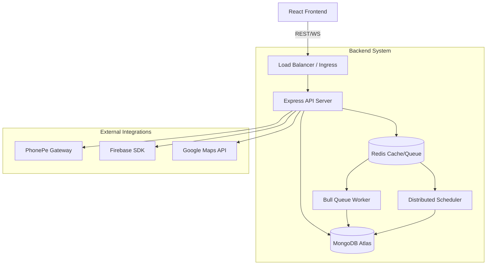
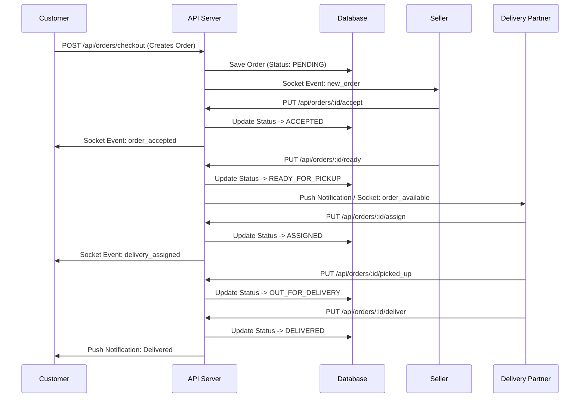

# Architecture Overview

Zoognu Quick Commerce is a microservices-inspired monolithic application designed for scale, real-time tracking, and high concurrency. It is divided into an Express API Backend and a React Frontend.

## High-Level Topology

## Core Components
- **API Server (`http`)**: Serves REST requests, handles real-time Socket.IO connections, manages authentication.
- **Queue Workers (`worker`)**: Offloads heavy tasks such as auto-canceling unaccepted orders, handling delivery timeouts, and push notification processing.
- **Scheduler (`scheduler`)**: A distributed job runner to manage recurring tasks like releasing payout holds or batch processing ledger entries.

## Primary Business Workflows

### Order Lifecycle

## Real-Time Subsystem
The real-time tracking heavily utilizes Socket.IO. We maintain segmented rooms:
- `order_room_{orderId}`: For customers and delivery tracking.
- `seller_{sellerId}`: For seller-specific real-time notifications.
- `ticket_{ticketId}`: For real-time support chat.
